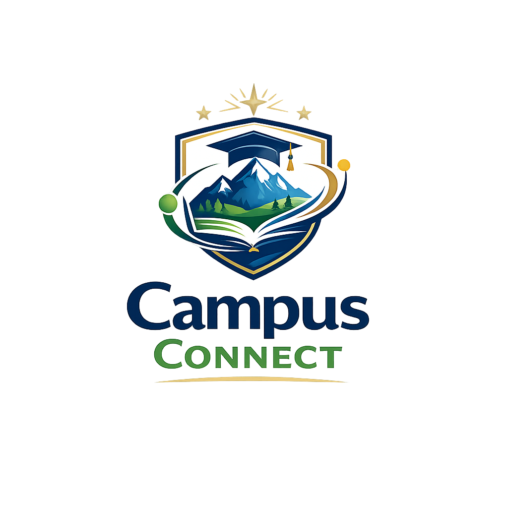

# 🎓 Campus Connect — Frontend Web Portal

<div align="center">
  
  <p><em>A Premium, High-Fidelity Student Hub and Peer-to-Peer Campus Ecosystem</em></p>
  
  [](#)
  [](#)
  [](#)
</div>

---

## 🌟 Executive Summary

**Campus Connect** is a production-grade, state-of-the-art web portal designed to serve as the unified central hub for modern university student life. Emphasizing premium aesthetics, accessibility, fluid responsive systems, and high performance, the portal bridges the gap between academic and social activities. 

Built using a **mobile-first layout system** with a sleek design architecture (glassmorphism, vibrant responsive gradients, dynamic interactive micro-animations), the platform seamlessly integrates dark/light themes and custom transition drawers to ensure an immersive experience across all breakpoints (from a 320px phone to massive desktop displays).

---

## 🚀 Key Platform Features

### 💻 Peer-to-Peer Hubs
*   **Dynamic Social Feed (`/feed`):** A fully-featured campus social space where students can post thoughts, share updates, upload media, and engage with peers through real-time feedback loops, structured likes, and comment threads.
*   **Integrated Marketplace (`/marketplace`):** A beautiful peer-to-peer bazaar enabling students to list textbooks, dorm items, or services, complete with categories, quick filters, saved item shortlists, and direct chat links.
*   **Job & Internship Board (`/jobs`):** Interactive career board with multi-attribute filtering (Role, Type, Location), detailed visual preview cards, and single-click application pipelines.
*   **Campus Events Manager (`/events`):** Activity calendar detailing academic and social gatherings, featuring dynamic categories, RSVPs, locations, and time formatting.
*   **Dynamic Resume Builder (`/resume`):** A robust dashboard allowing students to input their professional metadata, generating polished, university-aligned resume layouts ready for instantaneous generation and export.

### 🎨 Visual & Experience Polish
*   **Fluid Responsive Typography:** Implemented via advanced CSS `clamp()` utilities, ensuring headers, subtexts, and paragraphs dynamically scale to match the device dimensions perfectly.
*   **Premium Theme System:** Variable-first CSS architecture seamlessly switching between a clean, bright Light Theme and a deep, neon-accented Dark Theme. High-contrast elements, customized form inputs, and SVG color transforms prevent white-out screens.
*   **Offcanvas Navigation Drawers:** Modern mobile drawer transitions (`Navbar.jsx` and `Header.jsx`) utilizing react-bootstrap's Offcanvas. Controlled through highly-resilient manual React state to guarantee touch-outside closing, and click-on-select dismissal.
*   **Edge-to-Edge Chat UI (`/messages`):** Real-time look-and-feel conversation portal. On mobile devices, the thread selection screen disappears when entering a chat, presenting a full-screen messaging layout that mirrors native mobile chat applications.

---

## 🛠️ Technological Stack

*   **Core Engine:** [React 18](https://react.dev/) + [Vite](https://vitejs.dev/) (for blazing fast Hot Module Replacement)
*   **Styling & Structure:** [React Bootstrap 5](https://react-bootstrap.github.io/) + Vanilla CSS Custom Variables (strictly variable-first architecture)
*   **State Management:** Unified Context API:
    *   `AuthContext.jsx` (Session token handling, user profiles, mock/live session states)
    *   `AppContext.jsx` (Marketplace cart states, dynamic listing bookmarks, application queues)
    *   `ThemeContext.jsx` (Global HTML theme selector & LocalStorage persistence)
    *   `MessagingContext.jsx` (Real-time mocks, message logs, and thread management)
*   **Iconography:** [React Icons](https://react-icons.github.io/react-icons/) (FontAwesome, Ionicons)

---

## 📂 Architecture & Directory Layout

```bash
campusconnect/
├── public/                 # Static assets (logos, placeholders)
└── src/
    ├── assets/             # Global media files and graphics
    ├── components/         # Shared reusable components (Header, Footer, Navbar, etc.)
    ├── context/            # Context Providers (Auth, App, Theme, Messaging)
    ├── data/               # Seeded initial application mock data
    ├── hooks/              # Custom utility hooks
    ├── layouts/            # Page shell layouts (AuthLayout, MainLayout)
    ├── pages/
    │   ├── protected/      # Core dashboard pages (Dashboard, Feed, Marketplace, Resume, etc.)
    │   └── public/         # Public marketing pages (Home, Login, Signup)
    ├── routes/             # App routing and route guards (AppRoutes.jsx)
    ├── services/           # API and WebSocket connection wrappers
    ├── styles/             # Modular styling stylesheets
    └── utils/              # General helper scripts & validators
```

---

## ⚡ Setup & Installation

### Prerequisites
*   [Node.js](https://nodejs.org/) (Version `>= 18.0.0`)
*   [npm](https://www.npmjs.com/) (Version `>= 9.0.0`)

### Step-by-Step Run Guide

1.  **Clone and navigate to the frontend portal directory:**
    ```bash
    cd "c:/Users/Adyss_3/Documents/GITHUB/campus_connect APP/campus_connect/campusconnect"
    ```

2.  **Install dependencies:**
    ```bash
    npm install
    ```

3.  **Start the local development server:**
    ```bash
    npm run dev
    ```
    *The web portal will now be running locally at `http://localhost:5173`.*

4.  **Create a production bundle (optional):**
    ```bash
    npm run build
    ```
